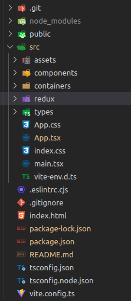

# User list app - Functional specifications

## Practical-5

- Once the above app UI is created, let’s change static data to dynamic data using API implementation.
- Please go through the API documentation for getting the list of users on this page - https://reqres.in/
- Example: for listing 1st 6 users the endpoint for API is - https://reqres.in/api/users?page=1
- We also need to implement pagination in this application - so when the user clicks on page 2, the API endpoint should be https://reqres.in/api/users?page=2
- For Pagination I use my custom API - https://servers-omega.vercel.app/users/p?limit=8&page=1

## 🚀 Live Demonstraion

- [User list app](https://charming-crepe-5c855d.netlify.app/)

## Setup Project Environment

- install all packages

  > ` npm install` :

- write below command

  > `npm run dev` : Start project on default Port
  >
  > - running npm run dev will start a development server that serves the Vite application and watches for changes to the code.
  > - Specifically, npm run dev will run the vite command with the --mode development option, which starts a development server that uses the Vite build tool to serve the application.
  > - As you make changes to the code, Vite will detect those changes and automatically rebuild and reload the application in the browser. Vite uses a fast and efficient development server that leverages browser-native ES modules to avoid expensive transpilation and bundling steps during development, which makes it faster and more responsive than many other development servers.

## External dependencies used in this project

> `@reduxjs/toolkit` :
>
> - @reduxjs/toolkit is a package that provides utilities to simplify common Redux use cases. It includes a function called createSlice that helps to reduce boilerplate code when defining Redux reducers, as well as other features like a configureStore function that sets up a Redux store with sensible defaults.
> - createSlice allows you to define a slice of your Redux store that includes both the reducer and actions in a single file, instead of defining them separately. This can help to reduce the amount of code you need to write and make it easier to manage the state of your application.
> - configureStore provides a simple way to set up a Redux store with good defaults. It includes things like middleware, preloaded state, and devtools setup.

> `react-redux` :
>
> - react-redux is a library that provides bindings between React and Redux. It simplifies the process of passing the Redux store and dispatching actions to child components of a React app.
>
> - The <Provider> component wraps the root component of the React app and provides access to the Redux store throughout the component tree.
>
> - With react-redux, components can access data from the Redux store without having to manually pass down the data as props. This makes the development process faster and more efficient.
>
> - react-redux also provides hooks to simplify the process of accessing data and dispatching actions. The useSelector hook allows components to access data from the Redux store, while the useDispatch hook provides access to the dispatch function.

> `react-spinners` :
>
> - React Spinners is a collection of loading spinner components for React. It provides a set of customizable, composable loading spinners that can be used to indicate the loading status of a component or page.
> - React Spinners is easy to use, and it offers a variety of loading spinners that can be styled to fit the design of the application. It's a popular library among React developers who need to implement loading spinners in their applications.
> - React Spinners is built using CSS and JavaScript and can be installed as an npm package. It's an open-source library, and the source code is available on GitHub.

## Folder Structure

